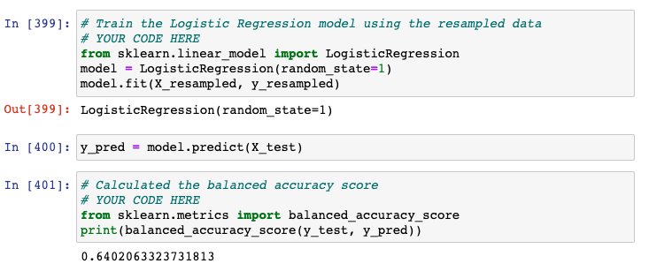
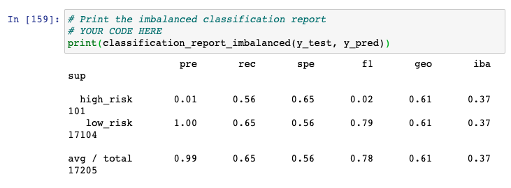

# Credit_Risk_Analysis

## Overview
The purpose of this project is to evaluate the performance of different ML algorithms for Credit Risk Analysis.

## Results
Following snapshot shows the Balanced Accuracy Score and Classification Reports containing the Precision and Recall scores for all the six models:

### Logistic Regression Balanced Accuracy Score

### Logistic Regression Imbalanced Classification Report

### SMOTE Balanced Accuracy Score

### SMOTE Imbalanced Classification Report

### ClusterCentroid Balanced Accuracy Score

### ClusterCentroid Imbalanced Classification Report

### SMOTEENN Balanced Accuracy Score

### SMOTEENN Imbalanced Classification Report

### BalancedRandomForestClassifier Balanced Accuracy Score

### BalancedRandomForestClassifier Imbalanced Classification Report

### EasyEnsembleClassifier Balanced Accuracy Score

### EasyEnsembleClassifier Imbalanced Classification Report

## Summary
BalancedRandomForestClassifier seems to be the best candidate model for this analysis as its F1 score (0.82) is highest among all.

